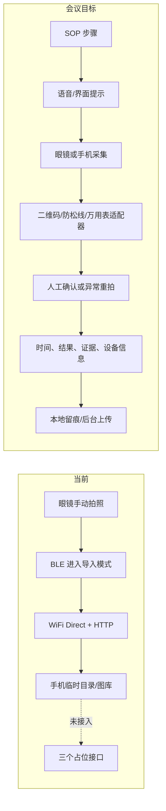

# AR-glasses-demo 缺口分析

## 结论

当前仓库是“连接与照片同步底座”，不是会议要求的巡检 MVP。它覆盖了眼镜到手机的媒体入口，
但尚未形成“任务引导—采集—识别—留痕”的任何完整闭环。

如果目标仍是约两周内演示，范围必须收紧为：固定一副 CY01、固定一台手机、固定三步 SOP、
手动按眼镜拍照、手机同步照片、三项算法可走服务器、结果先本地 JSON 留痕。手机遥控录像/补光、
通用后台编排和内窥镜应作为后续增量，否则时间风险很高。

## 现状证据

| Evidence | Finding | Path |
|---|---|---|
| `GlassBleService` 有 BLE、P2P、HTTP 和导入退出命令 | 已有照片传输主链路，但需实机复验 | `app/src/main/java/com/ar/glass/core/GlassBleService.java` |
| `DefaultImageAnalyzer` 三个方法均为占位返回 | 二维码、防松线、万用表均未实现 | `app/src/main/java/com/ar/glass/vision/DefaultImageAnalyzer.java` |
| 全仓只有 `Vision` 自身引用 | 识别接口未接入 UI 或同步完成事件 | `app/src/main/java/com/ar/glass/vision/Vision.java` |
| `settings.gradle` 只有 `:app` | 只有手机端 App，没有会议所述眼镜端 App | `settings.gradle` |
| 控制代码仅见照片导入/退出路径 | 未发现手机遥控拍照、录像、补光实现 | `app/src/main/java/com/ar/glass/core/GlassBleService.java` |
| 无后台、数据库或 API 模块 | 登录、SOP 下发、结果上传和历史记录均缺失 | 仓库文件树 |
| 无 `test`、工作流和 LICENSE | 无自动化回归证据，授权边界也未冻结 | 仓库文件树 |

## 当前与目标数据流

## 缺口优先级

### P0：没有这些就不算可演示 MVP

1. **基线复验与硬件矩阵**：记录眼镜型号、固件、手机系统、SDK/AAR 版本，连续验证连接、同步、
   取消、重试和退出导入模式。当前“代码看起来实现了”不能替代实机证据。
2. **固定三步状态机**：明确当前步骤、等待照片、识别中、需重拍、人工确认、完成/失败；避免三个
   独立按钮拼成假流程。
3. **真实算法接入**：二维码需要可运行实现；防松线和万用表至少要有服务器或端侧适配器，不再返回
   `null`/`false` 占位值。
4. **证据留痕**：每次巡检生成唯一 ID，保存步骤、时间、原图 URI、算法版本、结果、置信度、人工确认
   和失败原因。没有记录就无法对接中车流程，也无法沉淀训练数据。
5. **无眼镜测试入口**：手机拍照和相册导入必须走与眼镜照片相同的分析管线，支持并行开发和回归。
6. **失败安全**：识别失败、断连、超时、照片列表为空时保留原图，允许重试，并确保退出眼镜导入模式。
7. **受控验收集**：二维码、防松线、万用表各准备正常、异常、模糊、暗光、反光样本；记录准确率和
   失败模式，而不是只展示成功案例。

### P1：现场试用前补齐

- 手机/眼镜端控制拍照、录像、补光，并确认固件是否真的开放相应接口。
- 扬声器播报步骤、麦克风记录备注、单手/免手操作体验。
- 登录、人员/设备绑定、SOP 获取、记录上传、历史查询和最小后台。
- 防松线 ROI 引导、万用表屏幕矫正/去反光、置信度阈值与人工复核。
- 弱网/离线队列、幂等上传、数据加密、权限最小化和审计日志。
- 现场标注规范、模型版本管理和误判回流。

### P2：样板通过后再做

- 无线内窥镜的 WiFi/BLE 共存、预览、补光与深腔体操作验证。
- 树莓派/工业边缘盒离线推理及模型更新。
- 通用 JSON SOP 编排器、多巡检流程、多角色 CMS。
- 第一视角 episode 切分、脱敏、质检和训练数据交付。
- 向可显示/可交互的其他 AR 眼镜迁移。

## 建议验收门槛

| 项目 | 演示门槛 |
|---|---|
| 构建 | 干净环境 `assembleDebug` 成功，APK 可安装 |
| 连接 | 指定手机/眼镜连续 10 次连接与同步，记录成功率和耗时 |
| 流程 | 连续 3 轮三步 SOP 无人工改数据库或改文件 |
| 二维码 | 受控集可识别并正确写入点位与时间，失败可重拍 |
| 防松线 | 正常/异常均有样本；低置信度进入人工确认，不强行判定 |
| 万用表 | 数值、单位、小数点、负号或无效状态均结构化；失败可重拍 |
| 留痕 | 每轮可导出一份完整 JSON 和三张证据图，能追溯算法版本 |
| 安全退出 | 成功、取消、异常三条路径均恢复眼镜可拍照状态 |

## 关键判断

会议把“已有算法”“接口预留”“部署完成”混在了一起。工程上必须拆开：现有代码只证明接口和传输
框架存在；算法是否可用、是否接入流程、是否适应暗光反光、是否达到现场准确率，目前都没有证据。
